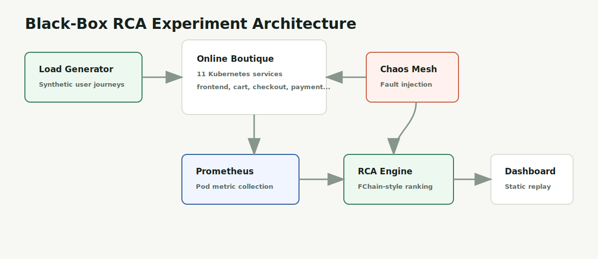
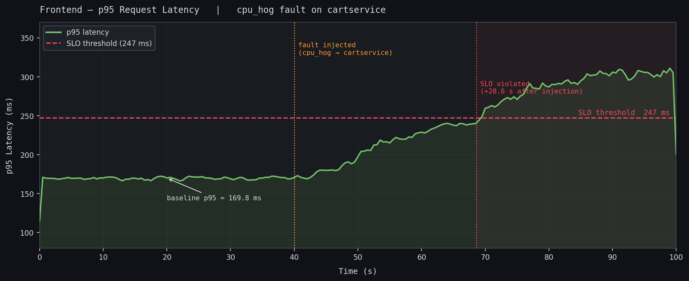
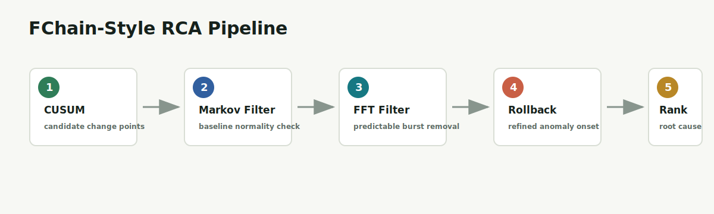

# Microservice Black-Box RCA

Black-box root-cause analysis for microservice failures using Kubernetes fault injection, Prometheus telemetry, and an FChain-style diagnosis pipeline.

[Live demo](https://aryansharma2k2.github.io/microservice-blackbox-rca/) · [Portfolio dashboard](portfolio/) · [Experiment runner](eval/run_experiment_slo.py) · [RCA engine](rca_engine/fault_chain.py)

> This was built as a group research project. This fork contains my portfolio deployment and presentation layer on top of the shared RCA experiment codebase.



## What This Project Does

Modern microservices fail in messy ways: a CPU spike in one service can show up as latency, memory pressure, network traffic, and downstream errors elsewhere. This project runs controlled chaos experiments against Google Online Boutique, collects black-box infrastructure metrics, and ranks likely root causes without instrumenting application code.

The hosted demo is a static replay of a real experiment artifact. The full fault-injection system is reproducible locally with `kind` or another local Kubernetes cluster.

## Highlights

- Runs Online Boutique on Kubernetes with Prometheus/Grafana monitoring.
- Injects faults with Chaos Mesh: `cpu_hog`, `mem_leak`, `net_delay`, and `packet_loss`.
- Falls back to `kubectl exec` for `disk_hog` where Chaos Mesh IOChaos is not supported locally.
- Collects seven pod-level metrics per service from Prometheus.
- Detects abnormal metric shifts using CUSUM, Markov normal models, FFT filtering, and tangent rollback.
- Ranks root-cause candidates using service onset times and the Online Boutique dependency graph.
- Ships a free static portfolio dashboard on GitHub Pages.

## Demo

The live dashboard replays a real `cpu_hog` experiment against `cartservice` and visualizes:

- fault timeline and SLO trigger
- ranked RCA suspects
- metric evidence
- Online Boutique dependency graph
- the RCA pipeline stages



## Architecture

The system has two layers:

1. **Experiment layer:** Kubernetes, Online Boutique, load generation, Chaos Mesh, and Prometheus.
2. **RCA layer:** metric collection, abnormality detection, onset refinement, dependency-aware ranking, and result export.



The core implementation lives in [rca_engine/fault_chain.py](rca_engine/fault_chain.py). It performs:

| Stage | Purpose |
|---|---|
| CUSUM + bootstrap | Find candidate change points in each service metric. |
| Markov normal model | Filter changes that still look normal under learned baseline behavior. |
| FFT burst filter | Reduce false positives from predictable workload bursts. |
| Tangent rollback | Estimate the true onset time of each abnormal metric. |
| Metric aggregation | Collapse per-metric anomalies into per-service onsets. |
| Dependency ranking | Use onset ordering and the service graph to rank root causes. |

## Tech Stack

| Area | Tools |
|---|---|
| Runtime | Python, NumPy, SciPy, pandas |
| Infrastructure | Kubernetes, kind, Helm |
| Observability | Prometheus, Grafana, cAdvisor metrics |
| Fault injection | Chaos Mesh, kubectl exec fallback |
| Demo deployment | Static HTML/CSS/JS, GitHub Pages |

## Repository Map

```text
rca_engine/          Core RCA pipeline and metrics client
fault_injection/     Chaos Mesh and kubectl-exec fault injectors
eval/                End-to-end experiment runners
infra/               Kubernetes, monitoring, and deployment scripts
calibration/         Propagation-delay calibration utilities
experiments/         Experiment matrix and generated run artifacts
portfolio/           Static dashboard deployed to GitHub Pages
tests/               Unit and integration tests
```

## Run The Portfolio Dashboard Locally

```bash
python3 -m http.server 4173 --directory portfolio
```

Open:

```text
http://localhost:4173
```

The dashboard is intentionally static so it can be hosted for free. It uses exported experiment artifacts instead of trying to run privileged Kubernetes workloads on public hosting.

## Reproduce The Full Experiment Locally

### Prerequisites

Install Docker Desktop, then:

```bash
brew install kubectl kind helm
pip install -r requirements.txt
mkdir -p /tmp/kind-volumes
```

### Deploy Online Boutique

```bash
bash infra/deploy-boutique.sh
```

Frontend:

```text
http://localhost:8080
```

If the port-forward stops:

```bash
kubectl port-forward -n boutique svc/frontend 8080:80 &
```

### Deploy Monitoring

```bash
bash infra/deploy-monitoring.sh
```

| Service | URL | Credentials |
|---|---|---|
| Prometheus | `http://localhost:9090` | none |
| Grafana | `http://localhost:3000` | `admin / admin` |

### Deploy Chaos Mesh

```bash
bash infra/deploy-chaos-mesh.sh
```

### Run Load

```bash
python infra/loadgen.py --duration 300 --rps 5 --pattern sine
```

### Run One SLO-Triggered RCA Experiment

```bash
python eval/run_experiment_slo.py \
  --fault net_delay \
  --service checkoutservice \
  --duration 120
```

For fixed-duration experiments:

```bash
python eval/run_experiment.py \
  --fault cpu_hog \
  --service frontend \
  --duration 120
```

Each run writes artifacts to:

```text
experiments/<run_id>/
├── ground_truth.json
├── timeline.json
├── metrics.parquet
├── rca_results.json
└── rca_timing.json
```

## Fault Injection Support

| Injector | Faults | Notes |
|---|---|---|
| `fault_injection/chaos_inject.py` | `cpu_hog`, `mem_leak`, `net_delay`, `packet_loss` | Works across the Online Boutique services, including distroless containers. |
| `fault_injection/inject.py` | `disk_hog` | Uses `kubectl exec`; limited to containers with a shell. |

Example:

```bash
python fault_injection/chaos_inject.py \
  --fault cpu_hog \
  --service cartservice \
  --duration 60
```

Concurrent fault example:

```bash
python fault_injection/chaos_inject.py \
  --fault cpu_hog \
  --service emailservice \
  --concurrent currencyservice \
  --duration 60
```

## Tests

```bash
pytest tests/
```

Run a focused test file:

```bash
pytest tests/test_fault_chain.py -v
```

The smoke tests require a live local cluster:

```bash
pytest tests/smoke_test.py -v
```

## Notes On Deployment

The public demo is deployed as a static GitHub Pages site from [portfolio/](portfolio/). The live Kubernetes experiment is not hosted publicly because free hosting platforms do not provide the privileged cluster access needed for Chaos Mesh fault injection.

To deploy this fork:

1. Set GitHub Pages source to **GitHub Actions**.
2. Push to `main`.
3. The workflow in [.github/workflows/pages.yml](.github/workflows/pages.yml) publishes the dashboard.

## Project Status

This repository is portfolio-ready: the research system can be reproduced locally, and the deployed dashboard provides a fast, browser-accessible walkthrough of the experiment and RCA output.
